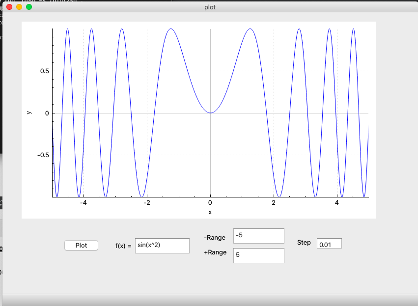

# a Light weight 2D_Plotter for MacOS.
my brother needed a simple 2d plotter for his highschool math class, 
couldn't find one that was simple for high-school students and free in the same time, so I created one.

# Plot differnet equations sin(x), log(x) and sqrt(x).

# Provides a step of 0.25 and -1 to 1 range if any is not provided.

# Plot multiple expression (cos(x^2) * log(x)).

 
# A demo of how the app works. 

# Icon

